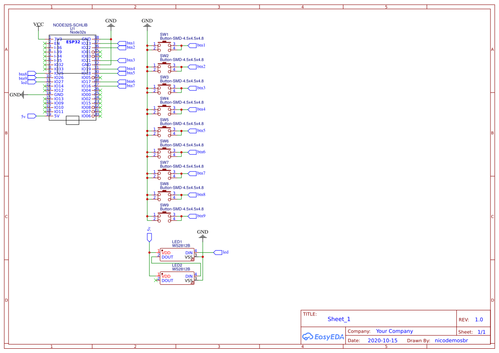
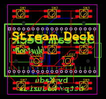
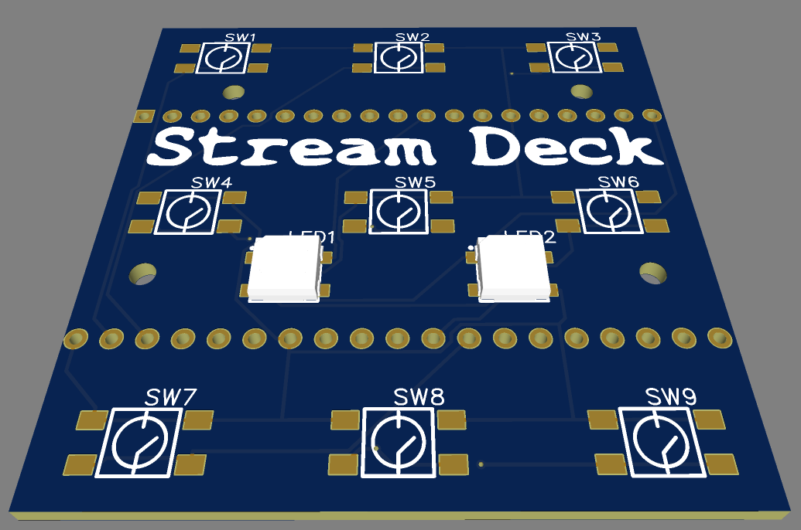
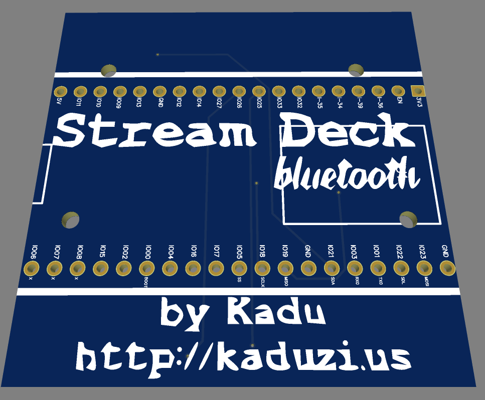
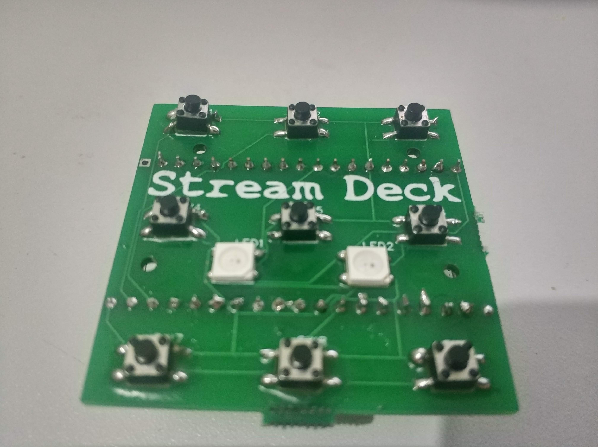
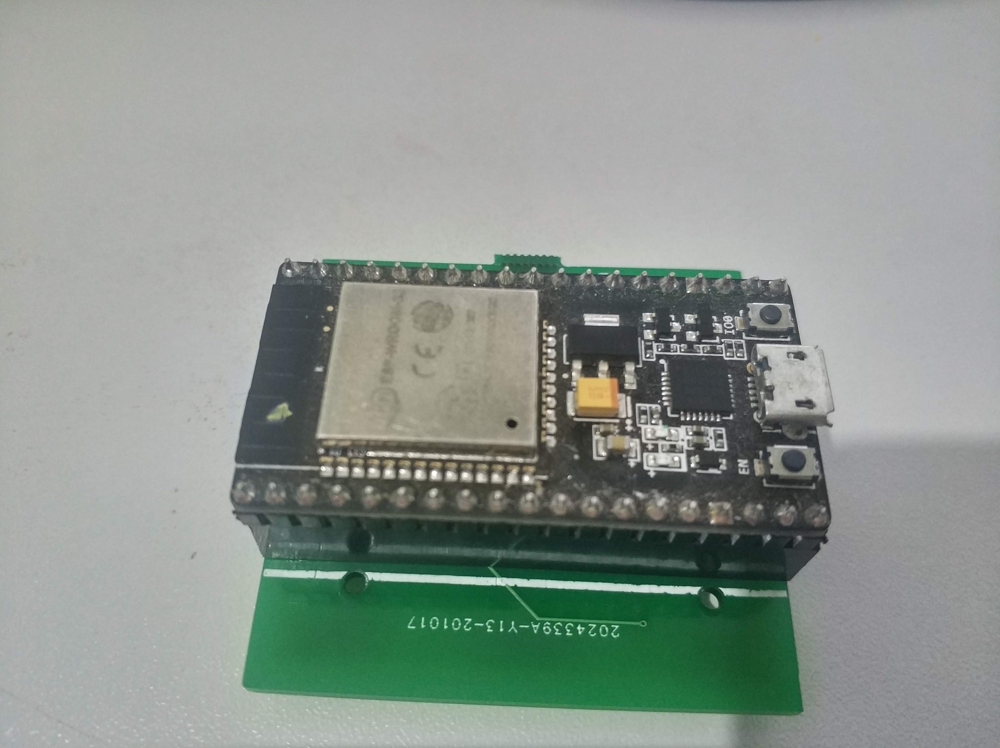

# StreamDeck BLE

During my firsts lives on twitch, I saw some streamers using cool hardware that with just some clicks on little screens can command all the live scenes, open and close programs, and other things, the name of this tech gadget, Elgato StreamDeck, here in Brazil it is so expensive that made me think how can I do the same without this keyboard, with a quick google search a lot of results are point to Arduino versions, someone more simple, others with OLED screens and almost same functionality that the original.

In my streams, I talk about IoT, Home Automation, Arduino, Electronics, and related things, in this moment I think, why do I not develop my own Stream Deck in my stream? Here we are, this is a result of some nights with friends talking about how cool will be to have a BLE keyboard that controls OBS.

**Let's share!**

The first version that I made fail badly (img1), I've used an Arduino Leonardo to send commands, using only one analog pin. My circuit sometimes sends the wrong value to the computer, and I lost some records because of that. After saw another twitch streamer (https://www.twitch.tv/tearing5) using the ESP32 as a Bluetooth keyboard I have the idea to create a simple node32s shield, with some buttons and RGB Leds (why not?) that send keystrokes to my computer.

-   Here is the schematic that I've created  

-   Here is the board that I made and send to JLCPCB to create my Board

-   And here are the board :D

**Show me "the code"**

The hardware part is a NODE32S as an MCU, and my PCB acting like an Arduino shield over it.

I've used 3 libraries
-   Adafruit NeoPixel - that brings RGB to life!
-   ESP32 BLE Keyboard - abstract all BLE stuff
-   OneButton - help with buttons

You can get the code here

**Configuration**

The "StreamDeck BLE" act as a BLE keyboard and has 9 buttons, each one sends a keystroke to the computer (CTRL+ALT+SHIFT+[LETTER]).

LETTERS:
| Button  | Letter   |
|----|----|
| 01 | Z  |
| 02 | Y  |
| 03 | W  |
| 04 | X  |
| 05 | V  |
| 06 | U  |
| 07 | T  |
| 08 | S  |
| 09 | R  |

**How to USE**

Just connect on "StreamDeckBLE" on your Bluetooth, go to OBS Settings -> Hot Keys, and press each button wherever you want  

**BE HAPPY**

https://oshwlab.com/nicodemosbr/streamdeck_ble